# Cawnsole Simple Display Shell

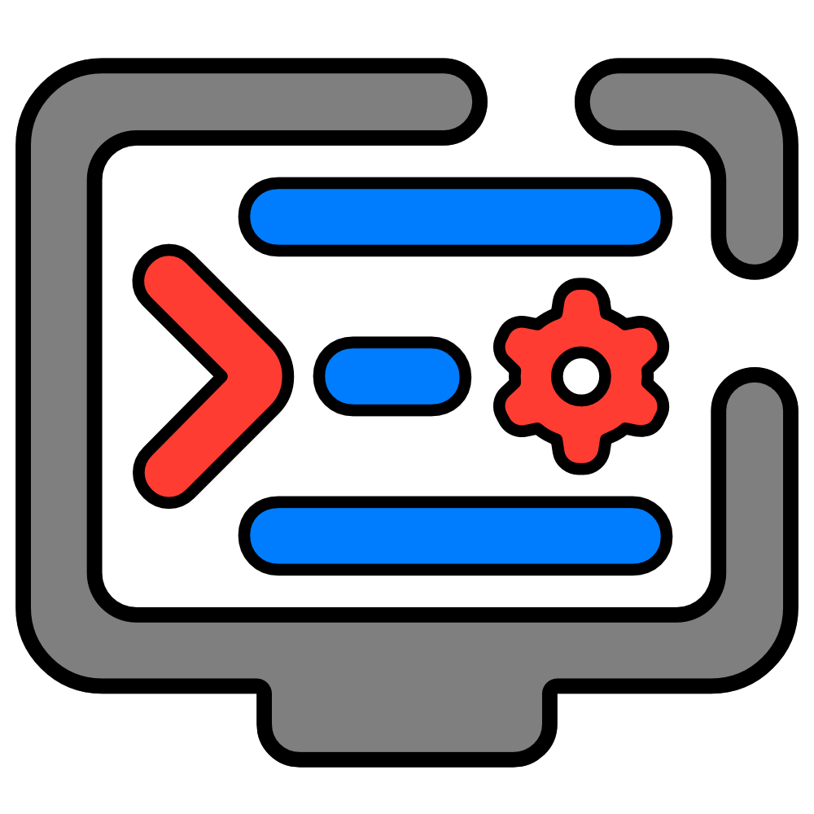

Quickly set the resolution, refresh rate, scale, VRR, & HDR through a minimal terminal based menu designed to just work.  

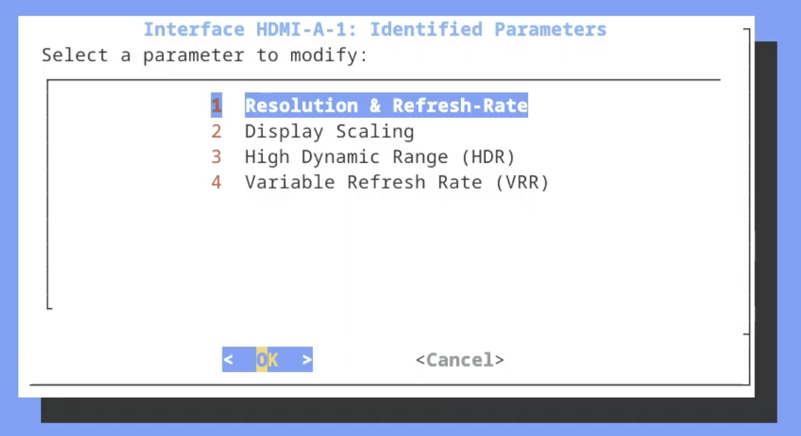

| Dependencies |
| --- |
| dialog |
| kscreen-doctor |

**NOTE:** Simple Display Shell does not enable new features or display parameters, simple display shell only exposes existing parameters.

## Installation & Use
### Installation Steps

1. Download the latest Simple-Display-Shell.sh file from the releases.
2. Move the Simple-Display-Shell.sh file anywhere desired.
3. Run Simple-Display-Shell.sh however you please (does not work when ran with sudo privilege).

### Using Simple Display Shell

Using the keyboard or mouse select the desired list item.

Running Simple Display Shell will initially show a list of all detected active display outputs. After selecting a detected output you will be shown another list of supported settings/ parameters to change for the selected output. Each subsequent selection will guide you through changing each parameter you select. 

After making a change, there will be a ten second confirmation window to confirm changes. The confirmation window also revert the changes if the ten second timer is reached.

After the selected change is confirmed or cancelled, the script will automatically close. To make another change, run the script again.

*The script will timeout and close after 60 seconds if no inputs are made.*

**Below are screenshots with the menu name**

#### Detected Outputs

**Main Menu**

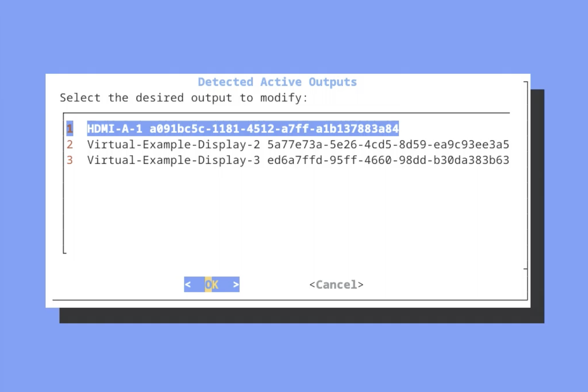

#### Identified Parameters

**Parameters For Selected Output)**

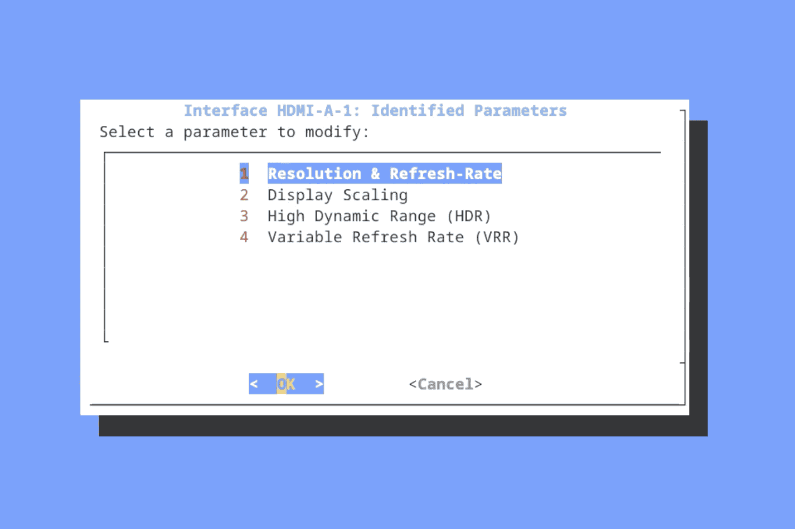

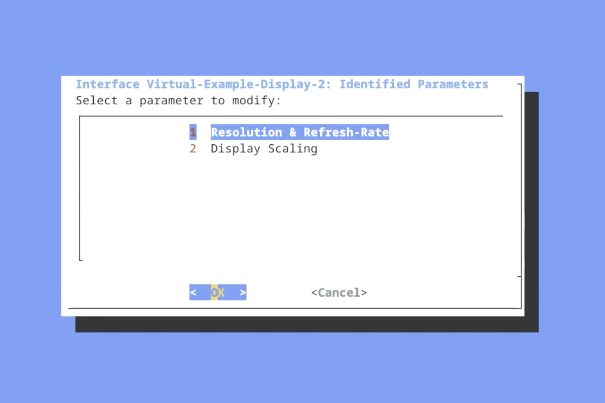

*(only detected parameters are shown)*

#### Identified Resolutions

**Resolutions For Selected Output**

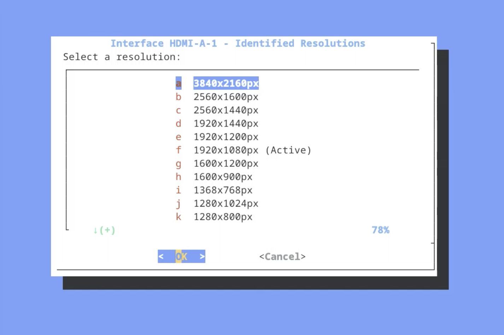

##### Identified Refresh Rates

**Refresh Rates For Selected Resolution**

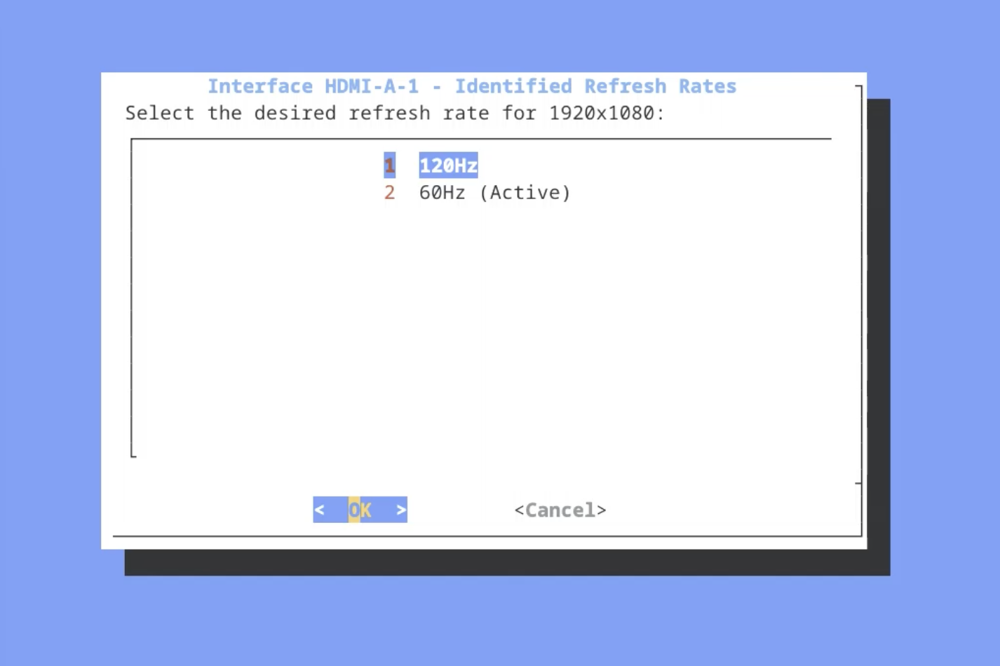

#### Display Scaling

**Scaling Sizes For Selected Output**

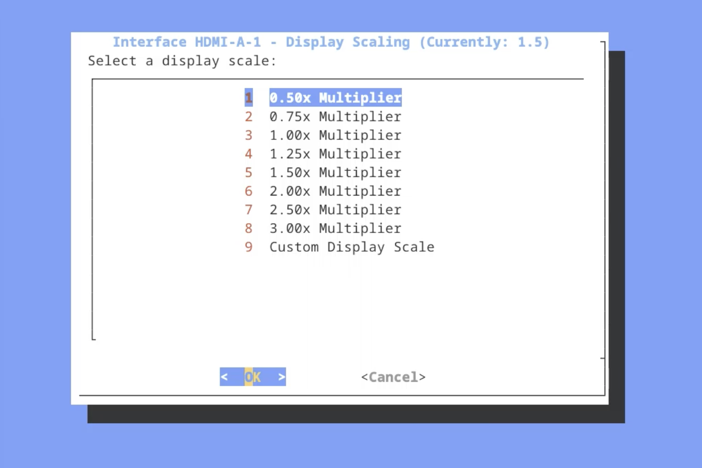

##### Custom Display Scale Input

**Manual Entry For Display Scale**

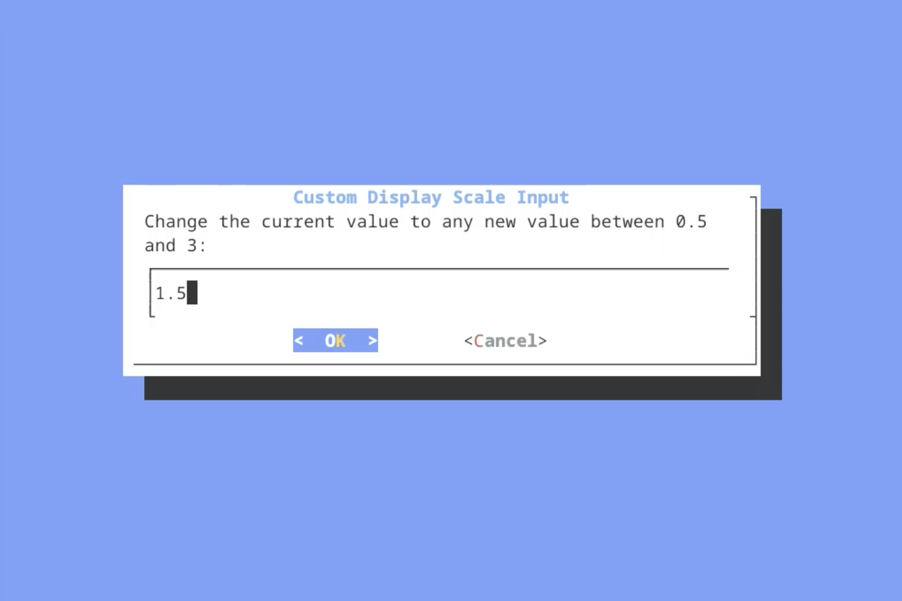

#### Variable Refresh Rate (VRR)

**Variable Refresh Rate Settings For Selected Output**

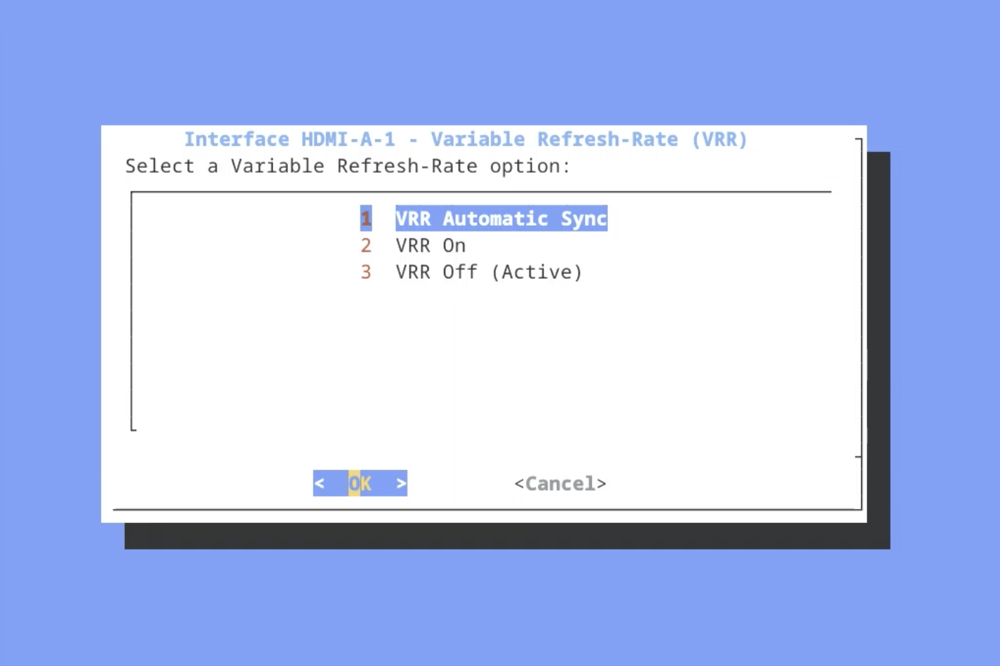

#### High Dynamic Range (HDR)

**High Dynamic Range Settings For Selected Output**

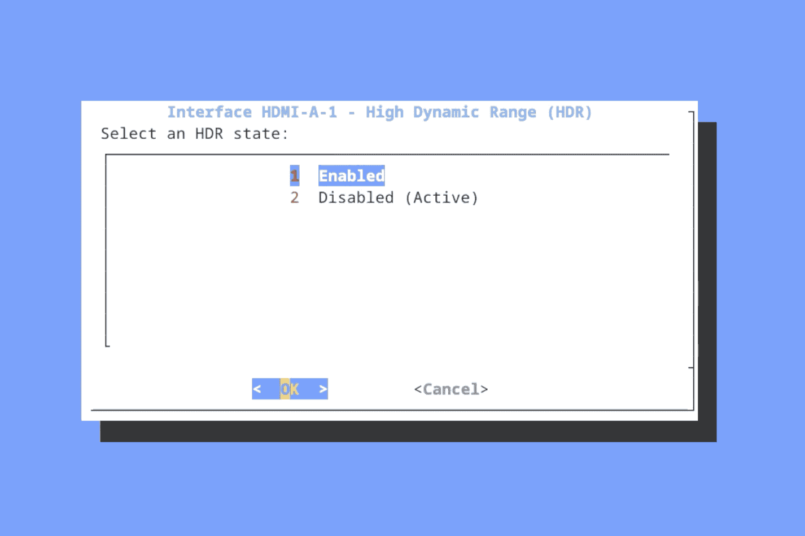

#### Confirm Changes

**Confirm Changes Timeout Failsafe**

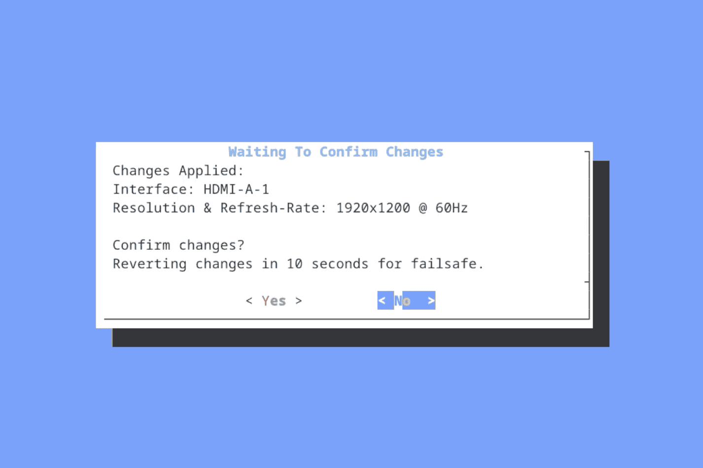